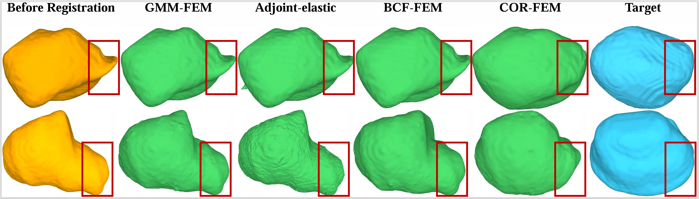

# Cor-FEM

**Cor-FEM** is a FEM-based algorithm for non-rigid medical image registration.

To the best of my (Shixing's) knowledge, this is one of the first non-linear FEM algorithms designed for non-rigid registration in ZBC (zero_boundary_condition) setting.

<p align="center">
  <b>3D Volume → Surface Mesh → Mesh Smoothing → Non-rigid Registration by Cor-FEM</b>
</p>

---

## Overview

Cor-FEM performs non-rigid registration using a finite element method (FEM).
The current released configuration mainly supports **prostate registration**. More organ-specific parameters will be added in future updates.

```text
                                    Input 3D Volume
                                          │
                                          ▼
                                    volume2mesh.py
                                          │
                                          ▼
                                    Initial Surface Mesh
                                          │
                                          ▼
                                    mesh_smooth.py
                                          │
                                          ▼
                                    Smoothed Mesh (STL, OBJ, PLY, OFF, etc..)
                                          │
                                          ▼
                                    cor-fem-prostate.sh
                                          │
                                          ▼
                                    Registered Result
```

---

## Platform

The code is mainly developed and tested on:

```text
Ubuntu
```

Windows is also allowed, but before running the code on Windows, please disable the Blender-related functions.

---

## Registration Comparison

<p align="center">
  
</p>

## Runtime Comparison

Average runtime of different FEM registration methods on the **μ-RegPro** dataset.

| Method   | [GMM-FEM](https://github.com/siavashk/GMM-FEM) | [Adjoint-elastic](https://github.com/gmestdagh/adjoint-elastic-registration) | [BCF-FEM](https://github.com/zixinyang9109/BCF-FEM) | COR-FEM (Ours) |
| -------- | ------: | --------------: | --------------------------------------------------: | -------------: |
| Time (s) |   53.54 |          128.25 |                                              272.29 |      **35.26** |

A gpu speedup version: [fast-GMM-FEM](https://github.com/Msx00/fast-GMM-FEM.git)

A gpu speedup version: [fast-BCF-FEM](https://github.com/Msx00/fast-BCF-FEM.git)

## Main Scripts

| File                  | Description                                                                          |
| --------------------- | ------------------------------------------------------------------------------------ |
| `volume2mesh.py`      | Converts a 3D medical volume, such as `.nii`, `.nii.gz`, `.nrrd`, etc., into a mesh. |
| `mesh_smooth.py`      | Smooths the mesh generated by `volume2mesh.py`.                                      |
| `cor-fem-prostate.sh` | Runs the FEM-based non-rigid registration pipeline for prostate data.                |

---

## Usage

### 1. Generate mesh from 3D volume

```bash
python volume2mesh.py
```

### 2. Smooth the generated mesh

```bash
python mesh_smooth.py
```

### 3. Run prostate registration

```bash
bash cor-fem-prostate.sh
```

---

## Current Release

Currently, we only release the registration parameters for the **prostate**.

More organ-specific parameter settings will be added later, including:

* kidney
* liver
* other abdominal or pelvic organs

---

## 3D Volume Registration
The method will be updated soon.

## Notes

* The current version is mainly designed for research use.
* Please check and modify the paths in the shell script before running.
* If Blender is unavailable or not required, please disable the Blender-related functions before execution.
* The registration parameters may need to be adjusted for different organs, modalities, and image resolutions.

---

## Contributors

* **Shixing Ma** — Shandong University, SDU
* **Yuhao Wei** — Xidian University
* **Zhaoxi Lin** — Tianjin University, TJU
* **Shuwei Shao** — Nanyang Technological University, NTU
* **Yanting Zhou** — McGill University
* **Yipeng Hu** — University College London, UCL

---

## Citation

The citation information will be updated soon.

---

## License

The license will be updated soon.
